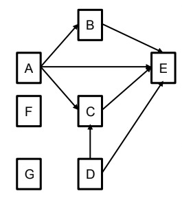

# multi-thread-joining

According to given input file, program creates threads including some rules. For instance, if you consider <b>'input1.txt'</b> file:


<b>A,B,C,D->E
<br>A->B
A,D->C
<br>F
<br>G</b>


This means that node E will wait for the execution of nodes A, B, C, and D to complete.
Similarly, Node B will wait for node A to complete. Nodes F and G will not wait for any node
to complete, so they should be executed immediately.

<p align="center"></p>

### How to run

Compile the code and package it as target directory:
```
mvn clean package
```
Run the program:
``` 
java -jar target/multi-thread.jar -i input1.txt
```

<b>Note:</b> '-i' argument specifies the location of input file.
